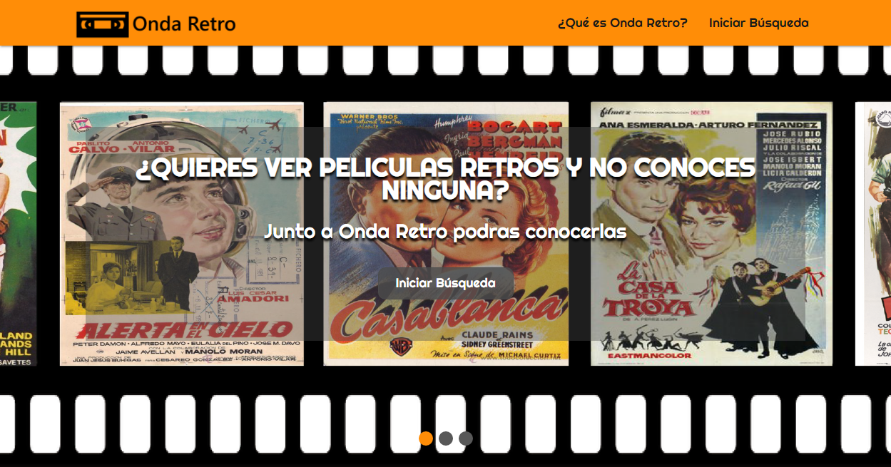
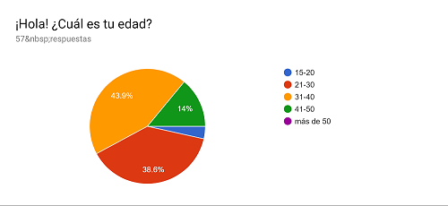
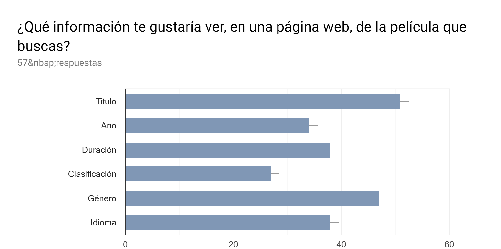
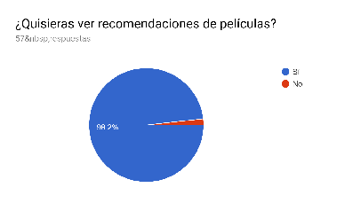
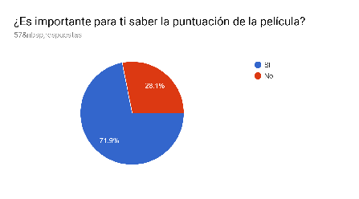
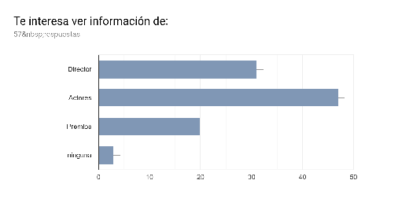
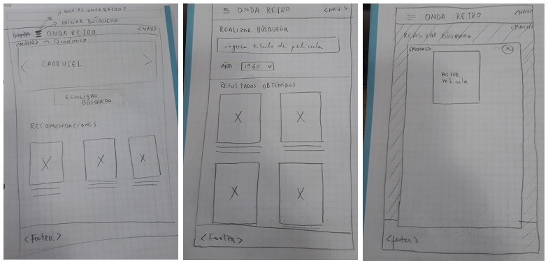
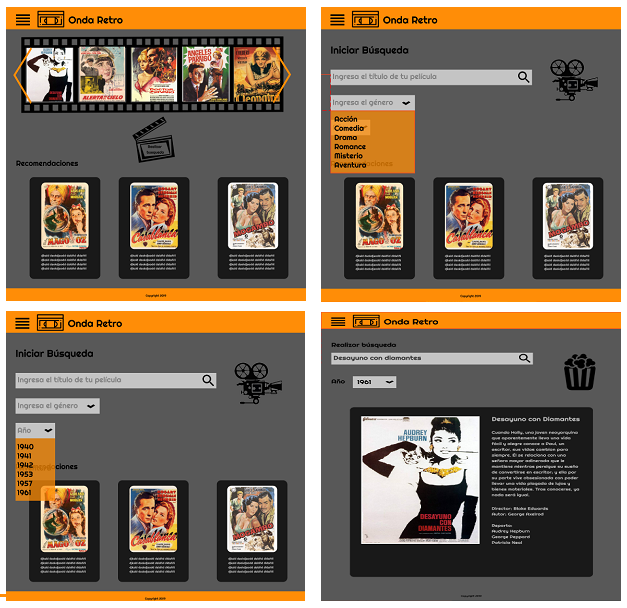

# ¡Bienvenido a Onda Retro!

## ¿Qué es Onda Retro? 

Esta es una aplicación web centrada en entregar información de películas estrenadas entre los años 1940 y 1960, para un público adulto mayoritariamente de 21 a 40 años, Aquí podrás filtrar por año, género e idioma (español, inglés y portugués). además podrás ver algunas recomendaciones en el extremo inferior de la página; rescatando las películas de antaño, te presentamos Onda Retro.

### Modo de uso

Para empezar a usar la interfaz, sólo debes clickear el icono central con la frase "realizar busqueda", esta acción te dirigirá a la pantalla dónde se encuentran las opciones de busqueda, puedes filtrar por año, género, y ademáspodrás filtrar por el idioma en el que quieres leer la información (español, inglés y portugués). Aparecerán en pantalla la o las imagenes que coincidan con tu busqueda. Para acceder a la información de la pelicula haz click en la imágen y se desplegará la información adicional.

## Planificación 🚀

En la organización utilizamos trello, delimitamos tareas y trabajamos con la metodología "pair programing".

### Definición: ¿Quién es nuestro usuario? 

Antes que nada, fabricamos una encuesta para saber qué tipo de información espera obtener la gente de una interfaz como la nuestra, y aproximar un rango de edad al que dirigirnos.

- Viendo que en su mayoría, quienes usan este tipo de páginas son personas de entre 21 a 40 años, desidimos enfocarnos en ese rango etario.

- Queríamos enfocarnos en tres filtros, las alternativas eran: título, año, duración, clasificación, género e idioma; y en base a lo que se muestra en el gráfico y nuestro proposito, desidímos hacerlo por género y duración, no descartando las otras posibilidades para el futuro.

-  Un 98.2% está interesado en obtener recomendaciones dentro de la interfaz.

- El 86% quiere tener a disposición una reseña de la película.

-  El 71% está interesado en saber la puntuación de las películas.

- Esta ultima pregunta, tiene a intención de saber qué podemos implementar más adelante, teniendo como prioridad, información sobre actores y directores de cada película, así como ambién el filtro por títulos.

 
### 1° Fase de Prototipado 📋

Una vez reconocido el usuario, comienza el proceso creativo compuesto por diferentes pasos que buscan dar con un resultado esperado por nosotras, pero principalmente pensado para el usuario. 

* Diagrama de flujo: esquema que grafica el flujo que debería tener la aplicación, considerando cambios de interfaces y filtración de información. 

### Planificación mediante Historias de Usuario ([Trello](https://trello.com/b/P3vXqQyX/hackathon-de-peliculas))

**¿Cuál es la necesidad de nuestro usuario?**

A partir de la encuesta realizada nacen distintas historias de usuario (**HU**)  que describen las necesidades de los usuarios, buscando cubrirlas a partir de los criterios de aceptación (**CA**) que se desarrollan en cada una de ellas.

A medida que se desarrolló Onda Retro se encontraron nuevas HU que permitieron generar una página completa y dinámica. 

* AGREGAR HU

Cada HU cuenta con una sección especial que abarca el formato responsivo. Buscamos que Onda Retro pueda ser visualizada desde pantallas de escritorio, Tablet y celular; entendiendo que el usuario utilizará la aplicación de manera transportable, complementando su uso con la app de Pokémon Go. 

### Segunda fase de Prototipado 📄✒️

**- __Prototipo de baja fidelidad__**

A partir del diagrama de flujo y el reconocimiento del usuario, y por medio de lápiz y papel, se creó un boceto con las diferentes interfaces y usos que se proponen para la app web. 

**- __Prototipo de alta fidelidad__**

Al reconocer  al usuario se definió los colores,  el tipo de información y su distribución a desplegarse en la app web. A partir del prototipo de baja fidelidad se realizaron algunos ajustes en cuanto a la presentación de la página principal, tutorial y de búsqueda. 

Las tareas a realizar fueron:

* Mejoras a partir del prototipo de alta fidelidad:

### Consideraciones en el desarrollo 🛠️

**Ejecución del interfaz de usuario HTML, CSS, JS**

* HTML para mostrar la página al usuario y unir los script de JavaScript y links de CSS, Materialize (incluyendo link al cdn de jquery para usar sus funciones).
* Uso de HTML dinámico desde el main.js
* Manejo del DOM desde main.js
* Desarrollo de funciones de filtrar, ordenar y estadística desde data.js
* Uso de la data de Pokémon Go a partir de pokemon.json
* Testeo de funciones desde data.spec.js
* Manejo de estilos CSS para la página de escritorio y responsivo, usando media query para celulares y Tablet.
* Trabajo colaborativo mediante el uso de Git y GitHub
* Deploy con gh-pages de la aplicación [Onda Retro](https://faog.github.io/SCL008_hackaton_peliculas/src/index.html)

**Implementación de las funciones solicitadas**

**Lorena Miranda:** 

Para esta interfaz, Lorena estuvo encargada de los aspectos relacionado con UX, creando en papel el prototipo de alta fidelidad y, en figma, el prototipo de alta fidelidad y testeos en video, usando Loom.

**Yaniza Molina, Fabiola Orellana y Paula Sáez**

Creadoras en conjunto de las historias de usuario, generamos filtros, modales e hicimos el readme.

### Futuras mejoras ⌨️

### Autoras 📌

**Girls Retro**

8° Generación de Laboratoria.

Marzo, 2019.